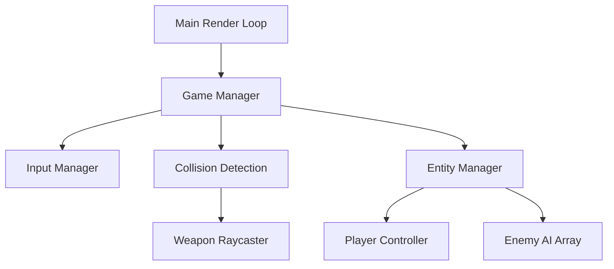

<div align="center">
  
</div>

<h1 align="center">WebGL 3D Zombie Survival (Three.js)</h1>

<div align="center">
  <p><strong>A high-performance, raw WebGL 3D First-Person Shooter built entirely in the browser using TypeScript and Three.js. No Unity, no Unreal—just pure JavaScript math.</strong></p>
  
  <p>
    <a href="https://tapiwamakandigona.github.io/fps-game/"></a>
    
    
  </p>
</div>

---

## ⚡ Architecture Overview

This repository demonstrates how to build a **Custom 3D Game Engine** inside a web browser. Instead of relying on heavy C++ game engines, this project uses **Three.js** to render 3D geometry and a custom-built TypeScript physics/collision handler.

It achieves **smooth 60 FPS performance** by leveraging:
- Optimized Low-Poly Geometries
- Custom Render Loops (`requestAnimationFrame`)
- PointerLock API for native FPS mouse control
- Frustum Culling & Object Pooling

<br/>

## 🎯 Gameplay Features

| Feature | Technical Implementation |
|------|-------------|
| **Wave-Based Spawning** | Dynamic array management of enemy instances with progressive stat scaling. |
| **Pathfinding Logic** | Vector3 math calculating shortest-path translation towards the Player's transform matrix. |
| **Hitscan Weapons** | Raycasting from the camera center point to detect bounding-box collisions. |
| **Mystery Boxes** | RNG (Random Number Generation) hooked into a state machine for weapon drops. |
| **Cross-Platform Input** | Unified InputManager mapping both `Keyboard+Mouse` (Desktop) and `Touch Event Joysticks` (Mobile). |

---

## 🔫 Weapons & Ballistics

- **Pistol:** Starting weapon, reliable.
- **Rifle:** High fire rate, medium damage.
- **Shotgun:** Devastating close-range power (spread calculated via Math.random angular offset).
- **SMG:** Spray and pray with high mobility.

---

## 🛠️ Core Technology Stack

- **Graphics:** Three.js (WebGL)
- **Language:** TypeScript
- **Audio:** Howler.js (Spatial 3D audio approximation)
- **Build System:** Vite
- **CI/CD:** GitHub Actions -> GitHub Pages

---

## 🏗️ Engine Structure



---

## 🚀 Local Deployment

To run this 3D engine locally on your machine:

**1. Clone the repository**
```bash
git clone https://github.com/tapiwamakandigona/fps-game.git
cd fps-game
```

**2. Install Dependencies**
```bash
npm install
```

**3. Boot the Dev Server**
```bash
npm run dev
```

---

## 🎮 Desktop Controls

| Key Bind | Engine Action |
|----------|---------------|
| `W A S D` | Vector3 Translation |
| `Mouse` | Camera Euler Rotation |
| `Left Click` | Raycast Trigger |
| `R` | Reload State |
| `E` | Contextual Raycast Interaction |
| `ESC` | Release PointerLock API |

---

<div align="center">
  <b>Engineering by <a href="https://github.com/tapiwamakandigona">Tapiwa Makandigona</a></b>
  <br/>
  <i>If you found this WebGL architecture interesting, please drop a ⭐ on the repo!</i>
</div>
