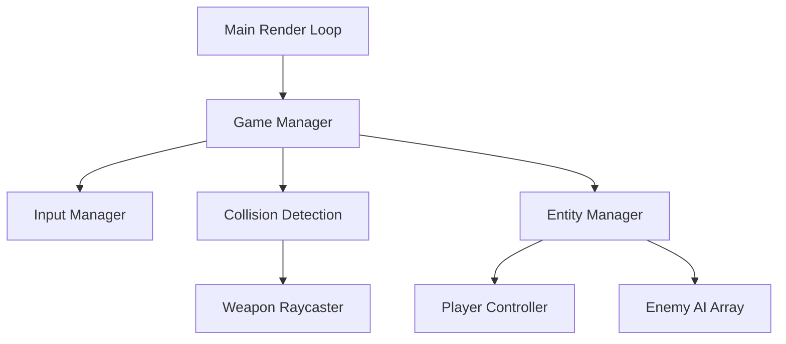

<div align="center">
  
</div>

<h1 align="center">WebGL 3D Zombie Survival (Three.js)</h1>

<div align="center">
  <p><strong>A high-performance 3D First-Person Shooter built entirely in the browser with TypeScript and Three.js (WebGL). No Unity, no Unreal—rendering via Three.js with custom TypeScript game logic, physics and collision.</strong></p>
  
  <p>
    <a href="https://tapiwamakandigona.github.io/fps-game/"></a>
    
    
  </p>
</div>

---

## ⚡ Architecture Overview

This repository demonstrates how to build a **Custom 3D Game Engine** inside a web browser. Instead of relying on heavy C++ game engines, this project uses **Three.js** to render 3D geometry and a custom-built TypeScript physics/collision handler.

It achieves **smooth 60 FPS performance** by leveraging:
- Optimized Low-Poly Geometries
- Custom Render Loops (`requestAnimationFrame`)
- PointerLock API for native FPS mouse control
- Frustum Culling & Object Pooling

<br/>

## 🎯 Gameplay Features

| Feature | Technical Implementation |
|------|-------------|
| **Wave-Based Spawning** | Dynamic array management of enemy instances with progressive stat scaling. |
| **Pathfinding Logic** | Vector3 math calculating shortest-path translation towards the Player's transform matrix. |
| **Hitscan Weapons** | Raycasting from the camera center point to detect bounding-box collisions. |
| **Mystery Boxes** | RNG (Random Number Generation) hooked into a state machine for weapon drops. |
| **Cross-Platform Input** | Unified InputManager mapping both `Keyboard+Mouse` (Desktop) and `Touch Event Joysticks` (Mobile). |

---

## 🔫 Weapons & Ballistics

- **Pistol:** Starting weapon with infinite reserve ammo.
- **Assault Rifle:** High fire rate, medium damage, 30-round magazine.
- **Shotgun:** Devastating close-range power (8-pellet spread via angular offset).
- **Sniper Rifle:** High damage single shots with 3× ADS zoom.
- **Machine Gun:** 50-round magazine, sustained fire.
- **Combat Knife:** Melee weapon with high damage, no ammo required.
- **Rocket Launcher:** Explosive AoE projectile with damage falloff.

---

## 🛠️ Core Technology Stack

- **Graphics:** Three.js (WebGL)
- **Language:** TypeScript
- **Audio:** Howler.js (Spatial 3D audio approximation)
- **Build System:** Vite
- **CI/CD:** GitHub Actions -> GitHub Pages

---

## 🏗️ Engine Structure


```mermaid
graph TD;
    Main[Main Render Loop] --> GM[Game Manager];
    GM --> IM[Input Manager];
    GM --> Physics[Collision Detection];
    GM --> EM[Entity Manager];
    EM --> Player[Player Controller];
    EM --> Zombies[Enemy AI Array];
    Physics --> Raycaster[Weapon Raycaster];
```

---

## 🚀 Local Deployment

To run this 3D engine locally on your machine:

**1. Clone the repository**
```bash
git clone https://github.com/tapiwamakandigona/fps-game.git
cd fps-game
```

**2. Install Dependencies**
```bash
npm install
```

**3. Boot the Dev Server**
```bash
npm run dev
```

---

## 🎮 Desktop Controls

| Key Bind | Engine Action |
|----------|---------------|
| `W A S D` | Vector3 Translation |
| `Mouse` | Camera Euler Rotation |
| `Left Click` | Raycast Trigger (fire weapon) |
| `Right Click` | Aim Down Sights (ADS zoom) |
| `R` | Reload |
| `E` | Interact (shop stations, mystery box) |
| `Space` | Jump |
| `V` | Melee (Combat Knife) |
| `1–6` | Switch Weapon Slot |
| `ESC` | Pause / Release PointerLock |

---

## 📁 Project Structure

```
src/
├── main.ts                  # Entry point, WebGL check, DOM setup
├── core/
│   ├── Game.ts              # Singleton game controller, state management
│   ├── GameLoop.ts          # requestAnimationFrame loop, delta smoothing
│   ├── PerformanceMonitor.ts# FPS/memory overlay (F3 toggle)
│   └── ScreenEffects.ts     # Screen shake, damage vignette, hit flash
├── entities/
│   ├── Player.ts            # First-person controller, collision, input
│   ├── Enemy.ts             # Abstract enemy base class (state machine)
│   ├── EnemyTypes/          # Concrete enemy implementations
│   ├── WeaponSystem.ts      # Weapon management, shooting, models
│   ├── Rocket.ts            # Rocket projectile with AoE explosion
│   ├── Pickup.ts            # Health & ammo pickups
│   ├── MysteryBox.ts        # Random weapon drop box (zombie mode)
│   └── ShopStation.ts       # Health & ammo shop (zombie mode)
├── managers/
│   ├── AudioManager.ts      # Procedural sound generation, Howler.js
│   ├── InputManager.ts      # Keyboard, mouse, touch & mobile controls
│   ├── LevelManager.ts      # Level building, wave spawning, endless mode
│   ├── ParticleManager.ts   # Particle effects (blood, explosions, shells)
│   └── UIManager.ts         # HUD, menus, health bars, crosshair
└── types/
    └── index.ts             # Enums, interfaces, game constants
```

---

<div align="center">
  <b>Engineering by <a href="https://github.com/tapiwamakandigona">Tapiwa Makandigona</a></b>
  <br/>
  <i>If you found this WebGL architecture interesting, please drop a ⭐ on the repo!</i>
</div>
